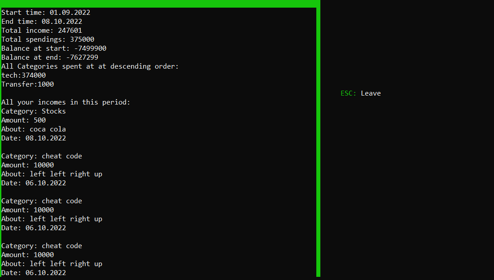

# Finance manager

<B>My new biggest project yet!</B>

To set balance path to any directory,  
Just change <i><a>const fs::path balpath </a> </i> (declared at line 5 in Finance.h)

This is what main page looks like: 

And this is review page: 

<B><I>Have fun!</B></I>
